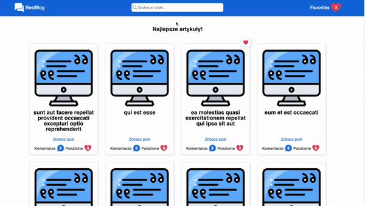

# Best Blog

It is a blog that presents articles and comments downloaded from [JSONPlaceholder](https://jsonplaceholder.typicode.com/).

Live version is available [here](https://youthful-pasteur-4ea549.netlify.app/).

<br/>



<br/>

## Table of contents

1. Technologies
2. Setup
3. Short description

<br/>

## 1. Technologiess

The following technologies were used in the project:

- React
- CSS Modules
- Redux
- Webpack

<br/>

## 2. Setup

First of all, you need to make sure you have [Node.js](https://nodejs.org/en/) installed.

If you have Node.js installed clone the github repo.

Open the project in your favourite IDE and run following script for downloading dependencies:

```
npm install
# or
yarn install
```

After that, create a dist folder:

```
npm build
# or
yarn build
```

After that, run the webpack server:

```
npm start
# or
yarn start
```

Open [http://localhost:3000](http://localhost:3000) with your browser to see the result.

<br/>

## 3. Short description

The home page displays a list of post sneak peeks based on downloaded data from the above-mentioned service [JSONPlaceholder](https://jsonplaceholder.typicode.com/).

Each mentioned sneak peek has information about the post title, the number of comments and the number of liked comments (in relation to specific post).

In order to facilitate browsing sneak peeks (and also comments), navigation has been introduced, which informs how many posts are currently displayed and how many are the maximum, and a search bar that allows filtering relevant content

<br>

After entering the article page by clicking the post sneak peek, we download from the service [JSONPlaceholder] the correct post with relevant comments.

On this page, we have the option of adding a post and comments to favorites, and we have the option of filtering comments (all/liked/not liked).

<br>

The last available page in the project is the favorites page, which allows to manage liked posts and comments.
